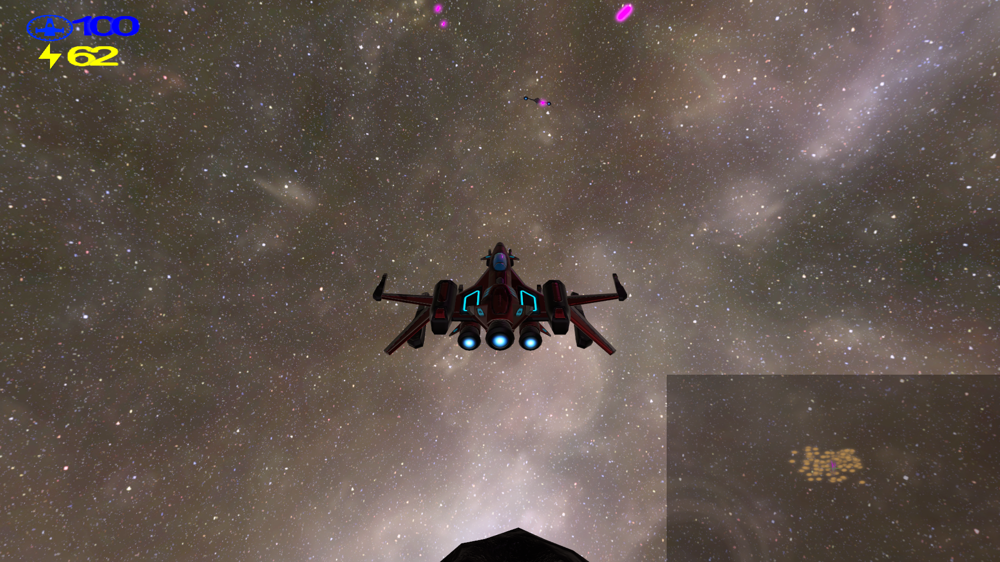
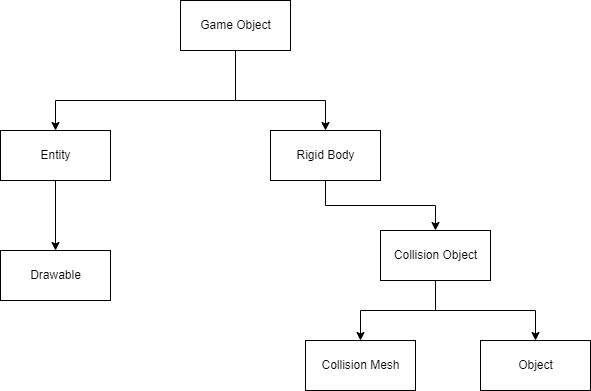
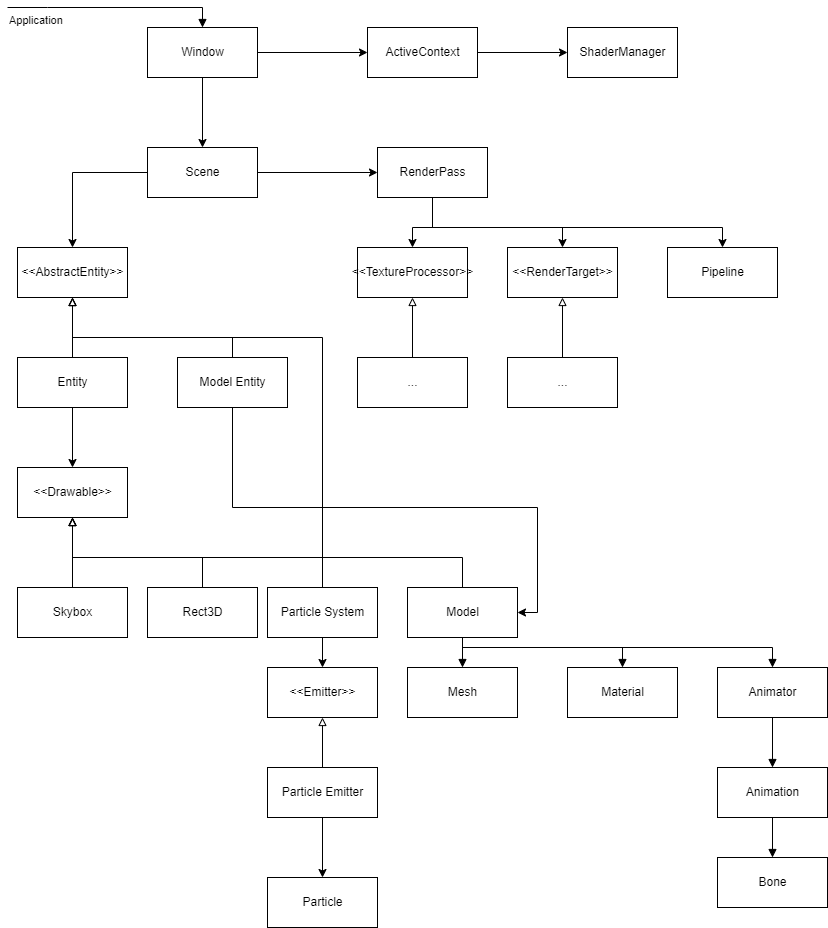
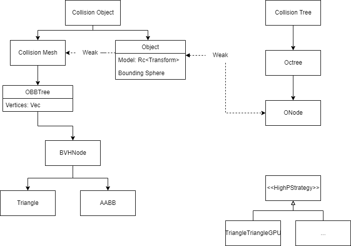
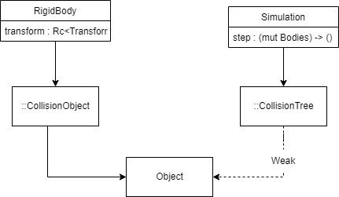
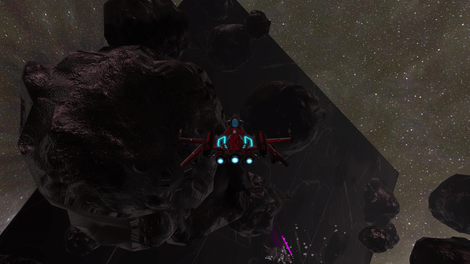
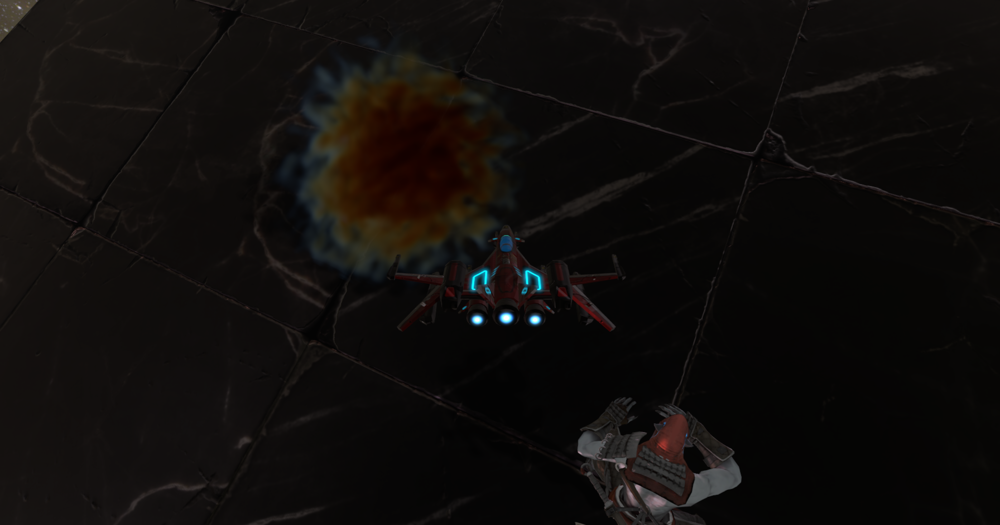

# Project Oort

This is a WIP development of an OpenGL 3D space combat game, taking place (mostly) in an asteroid field. 
The game lore remains mostly undecided. The plan is to be a multiplayer, third-person space shooter,
with most of the game lying in the space combat aspect. The plan is to have different factions/species
the player can choose from, each giving the player's ship different abilities available to them during combat.
Two collections of factions will make up the two overarching "sides" of the conflict which players can choose from. It should be noted this is build on Glium, and specifically the `layered-fbo` branch of my own fork of
of it.

Depending on how long I commit to working on this, there may be a small RTS aspect in which players can utilize the 
shared resources of their faction/alliance to create battles in the shooter aspect of the game similar to Heroes and Generals.

I also hope to be able to add single player modes by developing a combat AI.

If all else fails (either I move on or just keep adding more features to the engine), 
then this project will simply be a collection of technical features I found interesting and fun to work on.

**UPDATE**: I have decided to leave it (potentially for now) where it is. Multiplayer implementation has started
but I will likely not finish it. As it stands, the game is singleplayer only, where you battle against
an AI in deep-space themed combat.

## Architecture

The architecture is split into 4 main components: the graphics engine, physics engine, collision system, and actual game logic. I suspect the addition of a 5th component
for networking logic during multiplayer at the very least.
If the project grows more, then these components may become their own libraries.

Each component has a different "base unit", which are the items the component operates on. For the graphics engine, they are the drawable and
entity, where an entity is simply a drawable with added transformation information. For the collision detection system, it is the collision mesh, object, and collision object.
The collision mesh is, the collision mesh and its corresponding bounding volume hierarchy, the object is the specific location and bounding sphere information of particular
instances of a collision mesh, and the collision object is the outside facing struct that combined both of these. For the physics system,
the base unit is the rigid body and for the game the base unit is the game object.

The breakdown of objects is as follows:

Each `GameObject` represents a class of objects with the same geometry. Instance transformation information is stored as a vector of shared pointers among the `Entity` and `RigidBody`s.
Each `RigidBody` represents a single instance of the object, holding one of the aforementioned shared pointers. Similarly, each `Object` represents a single instance, holding a weak pointer to that instance's specific Octree node and bounding sphere. However, Each `CollisionMesh` is shared between all instances of the same geometry and it stores the mesh information as well as the BVH for that mesh.

### Graphics Engine

The graphics engine is built on a pipeline system of `RenderPass`es, `RenderTarget`s and `TextureProcessor`s. A render target is, well, a render target where objects are drawn to and (typically) produces a texture. A texture processor is essentially a function on textures. They may take inputs and may produce an output texture (or not). Finally, a `RenderPass`, (better named as `Pipeline`) strings together multiple `RenderTargets` and `TextureProcessors`. A `Scene` has a list of `Entity`s and `RenderPass`es.

### Collision Detection

OBBs are transformed from local space AABBs during collision detection. Otherwise,
the BVH is actually an AABB tree in local space, which becomes an OBB tree when transformed to world space to do collision detection by the specific instance `Object`'s shared transformation. Each Object also holds a weak reference to its parent octree node, which simultaneously holds a weak reference back to it.
This allows any object to easily query possible colliders

### Physics Engine

As of now, this is relatively straightforward with simply a `Simulation` which is composed on many `RigidBody` objects. The `Simulation` isn't actually composed of them, however 
the physics engine is composed of a `CollisionTree` which has weak references back to the `collisions::Object` which the `RigidBody` owns (via owning a `CollisionObject`).

### Object Equality

A shared pointer to a scene graph node (referred to commonly as `Transformation`) is shared among `Object`, `RigidBody`, and `Entity`. The equality of the addresses of these pointers
is used to determine whether an object is the same as another. An `ONode` holds a weak reference to an `Object`, and a `RigidBody` transitively owns an `Object`. Both the `RigidBody` and `Entity` (and transitively the `Object`) are owned by the `GameObject`.

## Current Technical Implementations

### Graphics
* Forward+ Rendering using the Gather Approach [^1] [^2]

    The gist of this technique is to determine which parts of an image are affected by which lights.
    We first render to a depth map from the camera's perspective. This texture, combined with lighting information
    is then sent to a compute shader to process it. In the compute shader, we use work groups to operate on
    16 x 16 px chunks of the image. The work group will find the minimum and maximum depths for its tile
    in the depth map. Using this, one thread in the group will then compute the frustum corresponding to that
    tile. Then, the threads will parallelize over all the lights and determine (based on light position and attenuation)
    which lights effect objects within a tile's frustum. The current implementation supports <= 1024 unique lights per 16 x 16 tile.
    Anything over that and the light contributions will be silently dropped.

    During the main rendering phase, we determine which tile the fragment is apart of, and use this to query only the lights
    that effect that fragment.

* Specular and Diffuse PBR Lighting model [^0]

    I use a diffuse IBL HDR saved on disk, and compute the Specular IBL and BRDF look-up texture
    from a skybox. If necessary, the engine can be easily augmented to support computing the diffuse IBL
    which would enable techniques such as Light Probes.

    Assimp is used to calculate the tangent space for normal mapping
    
* HDR and Bloom [^0]

    Using the aforementioned Pipeline, we have a texture processor to perform a separable convolution of a gaussian filter, and a texture processor
    to extract bright colors from the texture produced by the Main MSAA Render Target.

* Area Lights [^3]

    Currently I have lighting models for point, spherical, and tube area lights. The main idea for the area lights is to
    compute the light direction as a vector between the fragment position and closest point on the surface of the light emitter.

* Stable Cascading Shadow Maps [^4]

    Stability is achieved by finding bounding spheres of each cascade frustum instead of bounding boxes, and by rounding the frustum and
    view center to by multiples of the texel size.

* Soft Shadows with PCSS [^5] [^6] [^7]

    This (mostly) works with CSM. More tweaking needs to be done as there are slight artifacts with the different blur levels at
    different cascades. However, it's currently not too bad.

    My idea is to simply but direction light source(s) at bright areas in the skybox. I searched around for more realistic techniques, and
    this seems to be a common solution for realtime applications. It was also mentioned in *GPU Gems*. The next thing I thought of was rendering
    a cube map for each object, but that seemed too expensive so I didn't event attempt it.

* Particle System + Billboarding [^10]

    For most particles, I forsee the use of billboarded 2d textures. However the emitters can emit any drawable, so 3D particles are straight forward
    to support.

    Laser "smash" effect is done by simply assigning the velocity as randomly selected points on a sphere with a constrained zenith angle
    in spherical coordinates. Then converting the spherical coordinates to cartesian coordinates through a vector space 
    using the normal vector, a vector on the collision plane, and the cross product of those two as the orthogonal basis vectors.

* Animation

    Right now, this is just a demo and I don't yet have an actual animated model that fits the game's theme.

* Transformation Hierarchy with position, anchor, scale, and rotation.

* Invisibility Effect

    (See below)

* Volumetric Ray-Marched Dust/Nebulas [^11] [^12] [^13]

    The general gist is to generate a 3D volume texture via Perlin Noise with fractal brownian motion. We then compute rays in a Vertex Shader by computing
    the direction between the vertex and camera. In the Fragment shader, the 3D texture is sampled along these rays in discrete
    intervals. The sample roughly correlates to the opacity of the volume at the given point.

    Further Things to Take a Look At:
    * [PBR Atmosphere Frosbite](https://media.contentapi.ea.com/content/dam/eacom/frostbite/files/s2016-pbs-frostbite-sky-clouds-new.pdf)
    * [https://shaderbits.com/blog/creating-volumetric-ray-marcher](https://shaderbits.com/blog/creating-volumetric-ray-marcher)
    * [Siggraph 2014 Volumetric Fog](https://bartwronski.files.wordpress.com/2014/08/bwronski_volumetric_fog_siggraph2014.pdf)
    * [Possible Resource List](https://gist.github.com/pixelsnafu/e3904c49cbd8ff52cb53d95ceda3980e)
    * [Another paper](https://lup.lub.lu.se/luur/download?func=downloadFile&recordOId=8893256&fileOId=8893258)
    * [Siggraph 2011 Volumetric Rendering Tutorial](http://patapom.com/topics/Revision2013/Revision%202013%20-%20Real-time%20Volumetric%20Rendering%20Course%20Notes.pdf)
    * [Horizon Zero Dawn](http://killzone.dl.playstation.net/killzone/horizonzerodawn/presentations/Siggraph15_Schneider_Real-Time_Volumetric_Cloudscapes_of_Horizon_Zero_Dawn.pdf)

* Signed Distance Field Fonts

    Improved anti-aliasing by using signed distance fields for text rendering.

### Collisions

* 3-Phase collision detection system using bounding spheres, bounding boxes, and finally triangle intersection tests

* Spatial partition with an Octree to quickly determine possible object colliders [^8]

* Bounding Volume Hierarchy with AABBs to narrow down the amount of triangles to check when objects collide [^8]

    Tree traversal descends into the larger of the two nodes volume wise. BVH's store AABBs and during collision detection,
    transformations are supplied to convert the corners of the AABB to world space, where it is then turned into an OBB for
    collision detection.

* OBBs and OBB-OBB collision detection with the Separating Axis Theorem [^8]

* Triangle-Triangle intersection detection which is done in parallel via a compute shader [^8] [^9]

    Qualitatively, the usage of the GPU allows the BVH to remain relatively simple as the triangle checks
    on the GPU for this machine keeps the FPS at 60 on this machine while CPU implementation of the same
    method caused frame drops to 40 when colliding with objects.

    More work can be done with the BVH if necessary. Next steps would likely be using an OBB tree and
    using the axis of greatest variance to split the primitives. Generating the OBB tree would likely
    be best done by computing the covariance matrix of the points on the convex hull.

### Physics + Collision Resolution

A rigid body simulation is used to handle the physics and collision resolution. Each rigid body is given
a manually assigned mass, or a manually assigned density. In the latter case we can compute an estimated mass
using the volume of the body's bounding box.
For each rigid body we estimate an inertial tensor based on the vertices of the Rigid Body's collision mesh.

Then at each step of the simulation, we determine the magnitude, direction, and point of application of the forces
that are applied to each object. We then use the impulse momentum theorem to compute changes in velocity. 
We subtract the point of application from the object's center of mass to estimate a lever arm, and compute an applied
torque for the object. Using this and the inertial tensor, we are able to compute a rotational angular velocity.
I chose not to handle rotational velocity updates quite the same for the user-controlled ships for now, 
because it made the controls upon colliding with something feel unintuitive.

For collision resolution, we compute a point of contact by averaging the centroids of colliding triangles and an impact force
based upon the momentum of colliding bodies.

* Grappling Hook to "swing" from Asteroids

    The basic premise is that if the two objects connected by the "cable" are too far apart, we essentially update the velocities
    of both objects by treating the cable being pulled taught as an elastic collision.

### Behavior Tree Based AI

A behavior tree is used to control the non-player enemy in the game. The behavior tree is built up of
Sequence, Fallback, and ParallelSequence control nodes and custom action nodes for moving and firing.
Path finding is done using a 3D implementation of A*, by tiling the 3D space into little cubes. Once
a path has been computed, a simple local navigator that just follows the path in straight lines is used.

### Game Logic and Multiplayer

There's no deep aim of the game, the goal is to shoot down your enemies without getting
shot down yourself. Note that, there is no atmosphere and therefore there is no drag
that will slow down your ship. The ship moves at constant velocity unless acelerated
or decelerated. Progress has been made on introducing the necessary abstractions to support
a UDP server and client for multiplayer game mode, however I haven't finished it yet.

**Controls**: Left click to fire. Right click to fire a grappling shot. `T` to turn
invisible. `W`, `S` to accelerate forwards or backwards, and mouse movement to control rotation of
the ship

**Shield**: You have a shield, denoted by the blue number at the top left. If this goes to 0, your ship
is destroyed and you will respawn somewhere randomly on the map. Your shield will regenerate slowly
over time.

**Energy**: Denoted by the yellow number in the top left, your energy is necessary to fire lasers
and accelerate your ship. Your energy will regenerate slowly over time.

**Minimap**: In the bottom right, you have a minimap to see where you are in relation to lasers
and asteroids. The minimap is a 2D projection of 3D space which is "top-down" respective to your
camera angle.

**Grappling Hook**: You can fire a "hook shot" by pressing and holding right click.
Once landed on an object, a tether will be formed between the
target object and shooter. The distance between the shooter and the object will
not exceed the distance when the tether was formed. The amount a tethered object moves to
ensure this depends on the momentum of each tethered object. 
To release the tether, release right click.

---
## Images

**NOTE**: Gifs have been compressed and their framerate reduced.

---

## Next Steps

I don't forsee having much time to work on this during school, so the following are currently my *immediate* next TODOs.
There's still much more besides this and I am writing this so I know how to pick up where I left off when I get the time.

**UPDATE**: Most of these have been completed. There's plenty of more things I *could* do, but I will
probably end here, at least for now.

### Graphics

- [x] Conditional Pipeline Stages

    Some pipeline stages don't need to be done every frame. Ie, relevant stages for invisibility (see below)

    Implemented, but done very simply so a more sophisticated mechanism for this could be something to do in the future.

- [x] Pseudo-Invisibility through refraction

    Initial ideas are to render a cubemap around an object that may have transparency and compute refraction vectors to sample said cubemap.
    Problem with this is if multiple transparent objects overlap each other. Could solve this by ordering transparent objects by camera depth
    and generating the transparency textures from farthest to nearest. Could also look into OIT but not sure how well that works with refraction.
    During transparent texture generation, I was thinking of rendering all
    transparent objects as opaque, which won't pose a problem so long as we don't need highly reflective surfaces.

    I want the invisibility to be able to fade on and off, and thus the shadow to fade in and out. The idea that I think would work would be
    to use multi-out framebuffers to get a depth texture for opaque objects, and a depth texture for each translucent object along with each
    object's translucency factor. Another idea was to just render a depth texture, and transparency factor texture. Problem with this is if
    a translucent object occludes an opaque object. Possible solution to this could be solved by using a fragment shader to store depth information manually.

    Implemented by rendering an opaque and a transparent depth texture and computing the shadow factor as `(1.0 - invFac) * transparentShadow + opaqueShadow`. This works well for transparent objects that don't overlap. Artifacts can occur if we have a very transparent object occlude a partially transparent object since the `invFac` stored in the color texture belongs to the 
    nearest transparent object.

- [x] Good Dust Cloud Effect

    Need to add FBM and better shape generation. I initially wanted this to be used for a dust effect when something hits an asteroid.
    Realistically, a ray-marched volumetric is probably not the best thing to use for this given the real-time constraint.
    I think I can get a pretty decent effect by finding some good dust textures and using billboards with an artistically tuned
    particle system. In passing for doing volumetric rendering, I came across the technique "volumetric billboards" which
    might be something to look into.

- [ ] Better Lasers

    At the very least, could probably use a noise texture to provide color variation. I also think the geometry shader could be used to 
    decrease uniformity. [Maybe like this](https://developer.download.nvidia.com/SDK/10/direct3d/Source/Lightning/doc/lightning_doc.pdf)
    Could also use a particle system

- [x] (Optimization) Geometry shader for Billboards, rendering cascade maps in parallel, and rendering cubemaps in parallel

    May want to profile this. Currently used for rendering cubemaps in parallel only. It honestly was not as much of a performance
    change as I was hoping for (qualatatively).

- [ ] (Bug) Artifacts with PCSS and CSM. 

    You can kind of see a "sweep" when the shadows go from on cascade to the next. With straight CSM this is fixed by varying the PCF filter

- [x] (Nice-to-have) Rust macro to define a pipeline more easily. Idea was to try to create a DSL along the lines of Tikz graphs in Latex

### Physics + Collisions

- [x] (Bug) BVH not detecting collisions when the ship is the "self"
- [x] Add mass and moment of inertia to `RigidBody`

    I could probably estimate these values based on size and distribution of vertices

- [x] Torque and Force calculations

    Although it would be more realistic for player controls to apply forces on the ship, it may be weird and have a "sliding on ice"
    feel since, well, there's no air resistance in space. However it could also be a cool game mechanic, especially when asteroids start
    moving.

- [x] Make asteroids dynamic
- [ ] (Possible) use a swept ellipsoid for laser collisions. [Relevant Paper](http://www.peroxide.dk/papers/collision/collision.pdf)

## References
[^0]: [Joey DeVries Opengl](https://learnopengl.com/PBR/Theory)
[^1]: [Forward+: Bringing Deferred Lighting to the Next Level](https://takahiroharada.files.wordpress.com/2015/04/forward_plus.pdf)
[^2]: [Bcrusco Github](https://github.com/bcrusco/Forward-Plus-Renderer)
[^3]: [Alex Tardif's Area Lights](https://alextardif.com/arealights.html)
[^4]: [Alex Tardif's Stable CSM](https://alextardif.com/shadowmapping.html)
[^5]: [GameDev.net PCSS](https://www.gamedev.net/tutorials/programming/graphics/effect-area-light-shadows-part-1-pcss-r4971/)
[^6]: [Nvidia PCSS Paper](https://developer.download.nvidia.com/shaderlibrary/docs/shadow_PCSS.pdf)
[^7]: [Nvidia PCSS Implementation](https://developer.download.nvidia.com/whitepapers/2008/PCSS_Integration.pdf)
[^8]: [Ericson's Realtime Collision Detection](https://realtimecollisiondetection.net/)
[^9]: [A Fast Triangle-Triangle Intersection Test](https://web.stanford.edu/class/cs277/resources/papers/Moller1997b.pdf)
[^10]: [Opengl-tutorial Billboards](http://www.opengl-tutorial.org/intermediate-tutorials/billboards-particles/billboards/)
[^11]: [David Peicho Raymarching Cloud Demo](https://davidpeicho.github.io/about/)
[^12]: [Physically Based Sky, Atmosphere, and Cloud Rendering in Frostbite](https://media.contentapi.ea.com/content/dam/eacom/frostbite/files/s2016-pbs-frostbite-sky-clouds-new.pdf)
[^13]: [Siggraph 2011 Volumetric Rendering Course](http://patapom.com/topics/Revision2013/Revision%202013%20-%20Real-time%20Volumetric%20Rendering%20Course%20Notes.pdf)
